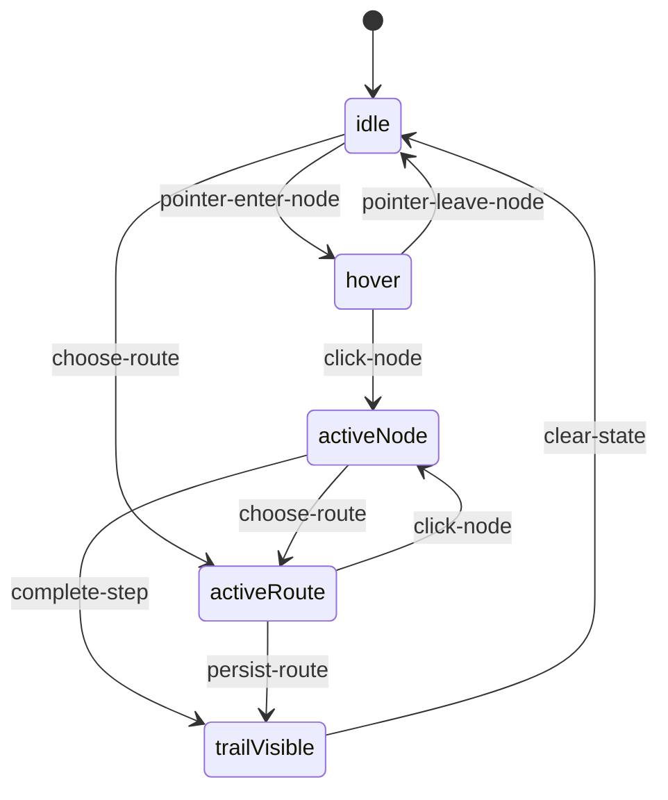
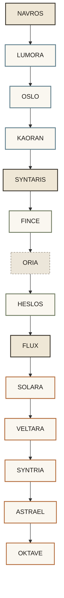

# Especificacao Frontend da Mandala

## Status

Este documento traduz a geometria exploratoria da mandala para uma camada mais util ao frontend. O objetivo e sair de uma visualizacao conceitual em Mermaid para um contrato implementavel em React e SVG, sem fingir que a geometria final ja esta fechada.

Referencias principais:

- [mandala-geometry.md](mandala-geometry.md)
- [mandala-structure.md](mandala-structure.md)
- [07_hipotese_dos_quatro_ciclos.md](../manual/07_hipotese_dos_quatro_ciclos.md)

## Escopo

Esta especificacao cobre:

- estados de interacao
- classes visuais
- coordenadas SVG normalizadas
- mapeamento para componentes React
- overlay das tres rotas naturais

Esta especificacao ainda nao cobre:

- geometria circular final
- motion system completo
- versao canonica reconciliada com todos os 16 agentes do PDF-base

## Artefato de Referencia

Esta especificacao agora tem um componente-base real em:

- [../implementation/frontend/mandala/MandalaCanvas.tsx](../implementation/frontend/mandala/MandalaCanvas.tsx)

Esse arquivo materializa a camada `React + SVG` desta especificacao com:

- tipos exportados
- dados iniciais da mandala
- `MandalaCanvas` controlado
- `MandalaPrototype` autocontido para demonstracao local

## Camadas de Geometria no Frontend

O trabalho mais recente da mandala pede separar duas camadas geometricas:

- geometria simbolica: circulo, 16 ancoras equidistantes e triangulo central
- projecao de interface v0: distribuicao simplificada para SVG e interacao inicial

No estado atual do repo:

- [mandala-geometry.md](mandala-geometry.md) registra a geometria simbolica
- [../implementation/frontend/mandala/MandalaCanvas.tsx](../implementation/frontend/mandala/MandalaCanvas.tsx) implementa a projecao v0

Essa separacao e importante porque o simbolo estrutural da mandala ja esta ficando mais claro do que a sua primeira projecao tecnica.

## ViewBox de Referencia

Para manter a implementacao simples e escalavel, a mandala pode usar um `viewBox` fixo:

```text
0 0 1000 1000
```

Centro do sistema:

```text
cx = 500
cy = 500
```

Para a futura versao geometrica parametrica, o frontend pode derivar as ancoras do anel a partir de coordenadas polares:

```text
angleStep = 360 / 16
x = cx + radius * cos(theta)
y = cy + radius * sin(theta)
```

Isso ainda nao substitui a malha v0; apenas prepara a migracao para uma versao mais simbolica e regular do mapa.

## Mapa de Coordenadas

Coordenadas de trabalho para a camada exploratoria:

| id | x | y | kind | notes |
| --- | --- | --- | --- | --- |
| ASTRAEL | 500 | 120 | outer | topo |
| VORAX | 350 | 200 | outer | superior esquerdo |
| LUNARA | 650 | 200 | outer | superior direito |
| SYNTRIA | 240 | 320 | outer | medio superior esquerdo |
| OKTAVE | 760 | 320 | outer | medio superior direito |
| SOLARA | 160 | 500 | outer | lateral esquerda |
| FLUX | 380 | 500 | core | nucleo |
| SYNTARIS | 500 | 500 | core | nucleo |
| NAVROS | 620 | 500 | core | nucleo |
| LUMORA | 840 | 500 | outer | lateral direita |
| VELTARA | 240 | 680 | outer | medio inferior esquerdo |
| KAORAN | 760 | 680 | outer | medio inferior direito |
| FINCE | 350 | 800 | outer | inferior esquerdo |
| ORIA | 500 | 760 | latent | posicao provisoria da rota de estrutura |
| OSLO | 650 | 800 | outer | inferior direito |
| HESLOS | 500 | 880 | outer | base |

Notas:

- `ORIA` entra aqui como no de trabalho para a rota de estrutura
- `ORION`, `ANERA` e `ORIGEN` continuam fora desta malha exploratoria
- o frontend deve tratar esta lista como `route overlay v0`, nao como modelo final do sistema
- a geometria simbolica final deve permitir ancoras regulares mesmo quando parte dos nomes ainda estiver em revisao

## Contrato de Dados

Exemplo de shape para o frontend:

```ts
type MandalaNodeKind = "core" | "outer" | "latent";
type MandalaVisualState = "idle" | "hover" | "active" | "trail" | "muted";
type MandalaRouteId = "perception" | "structure" | "action";

type MandalaNode = {
  id: string;
  label: string;
  x: number;
  y: number;
  kind: MandalaNodeKind;
  visible: boolean;
  provisional?: boolean;
  routeIds?: MandalaRouteId[];
};

type MandalaRoute = {
  id: MandalaRouteId;
  label: string;
  promptLabel: string;
  promptDescription: string;
  nodes: string[];
};
```

## Dados Iniciais de Referencia

```ts
export const mandalaNodes: MandalaNode[] = [
  { id: "ASTRAEL", label: "Astrael", x: 500, y: 120, kind: "outer", visible: true, routeIds: ["action"] },
  { id: "VORAX", label: "Vorax", x: 350, y: 200, kind: "outer", visible: true, routeIds: [] },
  { id: "LUNARA", label: "Lunara", x: 650, y: 200, kind: "outer", visible: true, routeIds: [] },
  { id: "SYNTRIA", label: "Syntria", x: 240, y: 320, kind: "outer", visible: true, routeIds: ["action"] },
  { id: "OKTAVE", label: "Oktave", x: 760, y: 320, kind: "outer", visible: true, routeIds: ["action"] },
  { id: "SOLARA", label: "Solara", x: 160, y: 500, kind: "outer", visible: true, routeIds: ["action"] },
  { id: "FLUX", label: "Flux", x: 380, y: 500, kind: "core", visible: true, routeIds: ["action"] },
  { id: "SYNTARIS", label: "Syntaris", x: 500, y: 500, kind: "core", visible: true, routeIds: ["perception", "structure"] },
  { id: "NAVROS", label: "Navros", x: 620, y: 500, kind: "core", visible: true, routeIds: ["perception"] },
  { id: "LUMORA", label: "Lumora", x: 840, y: 500, kind: "outer", visible: true, routeIds: ["perception"] },
  { id: "VELTARA", label: "Veltara", x: 240, y: 680, kind: "outer", visible: true, routeIds: ["action"] },
  { id: "KAORAN", label: "Kaoran", x: 760, y: 680, kind: "outer", visible: true, routeIds: ["perception"] },
  { id: "FINCE", label: "Fince", x: 350, y: 800, kind: "outer", visible: true, routeIds: ["structure"] },
  { id: "ORIA", label: "Oria", x: 500, y: 760, kind: "latent", visible: true, provisional: true, routeIds: ["structure"] },
  { id: "OSLO", label: "Oslo", x: 650, y: 800, kind: "outer", visible: true, routeIds: ["perception"] },
  { id: "HESLOS", label: "Heslos", x: 500, y: 880, kind: "outer", visible: true, routeIds: ["structure"] },
];

export const mandalaRoutes: MandalaRoute[] = [
  {
    id: "perception",
    label: "Rota da Percepcao",
    promptLabel: "Compreender",
    promptDescription: "Explorar o campo",
    nodes: ["NAVROS", "LUMORA", "OSLO", "KAORAN", "SYNTARIS"],
  },
  {
    id: "structure",
    label: "Rota da Estrutura",
    promptLabel: "Organizar",
    promptDescription: "Organizar a vida",
    nodes: ["SYNTARIS", "FINCE", "ORIA", "HESLOS", "FLUX"],
  },
  {
    id: "action",
    label: "Rota da Acao",
    promptLabel: "Agir",
    promptDescription: "Criar movimento",
    nodes: ["FLUX", "SOLARA", "VELTARA", "SYNTRIA", "ASTRAEL", "OKTAVE"],
  },
];
```

## Componentes React Sugeridos

Separacao minima para uma implementacao limpa:

- `<MandalaCanvas />`
- `<MandalaBackground />`
- `<MandalaRouteLayer />`
- `<MandalaCoreLayer />`
- `<MandalaNodeLayer />`
- `<MandalaTrailLayer />`
- `<MandalaLabelLayer />`
- `<MandalaInteractionLayer />`

Contrato sugerido do componente raiz:

```ts
type MandalaCanvasProps = {
  nodes: MandalaNode[];
  routes: MandalaRoute[];
  activeNodeId: string | null;
  hoverNodeId: string | null;
  activeRouteId: MandalaRouteId | null;
  trailNodeIds: string[];
  onNodeEnter?: (id: string) => void;
  onNodeLeave?: () => void;
  onNodeSelect?: (id: string) => void;
  onRouteSelect?: (id: MandalaRouteId) => void;
};
```

## Estados de Interacao

Estados minimos do frontend:

| Estado | Funcao |
| --- | --- |
| idle | nenhum no em destaque |
| hover | pre-visualizacao de no |
| active-node | no fixado em foco |
| active-route | rota destacada |
| trail-visible | percurso recente destacado |

Diagrama de estados:



## Classes Visuais

Convencao de classes CSS:

```text
.mandala
.mandala__background
.mandala__core-link
.mandala__node
.mandala__node--core
.mandala__node--outer
.mandala__node--latent
.mandala__node--hover
.mandala__node--active
.mandala__node--trail
.mandala__node--muted
.mandala__label
.mandala__route
.mandala__route--perception
.mandala__route--structure
.mandala__route--action
.mandala__route--active
.mandala__trail
```

Uso recomendado:

- `core`: no triadico
- `outer`: no estavel do anel
- `latent`: no provisorio ou em revisao conceitual
- `hover`: elevacao temporaria de contraste
- `active`: no selecionado ou retornado por leitura
- `trail`: nos pertencentes ao caminho recente
- `muted`: tudo o que nao pertence ao foco atual

## Tokens Visuais Minimos

Variaveis sugeridas:

```css
:root {
  --mandala-bg: #f7f3eb;
  --mandala-stroke: #7f7668;
  --mandala-core-fill: #efe7d6;
  --mandala-core-stroke: #3a352c;
  --mandala-node-fill: #faf7f0;
  --mandala-node-latent: #ece6da;
  --mandala-route-perception: #5c7c8a;
  --mandala-route-structure: #6e7a5f;
  --mandala-route-action: #b46d3c;
  --mandala-active: #1f1b16;
  --mandala-muted: 0.28;
}
```

## Mermaid com Classes Visuais



## Overlay das Tres Rotas

As tres rotas naturais surgem como vetores de entrada diferentes para perfis diferentes de usuario.

Pergunta de entrada:

> O que voce precisa agora?

Opcoes:

- compreender
- organizar
- agir

Mapeamento:

| Opcao | Rota | Modo |
| --- | --- | --- |
| compreender | percepcao | Explorar o Campo |
| organizar | estrutura | Organizar a Vida |
| agir | acao | Criar Movimento |

Convergencia:

- as rotas nascem em vetores diferentes
- todas acabam tocando novamente o nucleo
- isso transforma a mandala em sistema vivo, nao em menu fixo

## Mapeamento SVG Direto

Sequencia minima de renderizacao:

1. `<svg viewBox="0 0 1000 1000">`
2. `<g className="mandala__background">`
3. `<g className="mandala__route-layer">`
4. `<g className="mandala__core-layer">`
5. `<g className="mandala__node-layer">`
6. `<g className="mandala__trail-layer">`
7. `<g className="mandala__label-layer">`

Exemplo de no:

```tsx
<g
  className={clsx(
    "mandala__node",
    `mandala__node--${node.kind}`,
    isHover && "mandala__node--hover",
    isActive && "mandala__node--active",
    isTrail && "mandala__node--trail",
    isMuted && "mandala__node--muted",
  )}
  transform={`translate(${node.x} ${node.y})`}
>
  <circle r={node.kind === "core" ? 24 : 18} />
  <text y={44} textAnchor="middle">{node.label}</text>
</g>
```

Exemplo de rota:

```tsx
<polyline
  className={clsx("mandala__route", `mandala__route--${route.id}`, isActive && "mandala__route--active")}
  points={route.nodes.map(id => `${byId[id].x},${byId[id].y}`).join(" ")}
/>
```

## Limites e Proximos Passos

Antes de transformar isso em componente final, ainda precisam ser fechados:

- reconciliacao entre a camada canonica e a camada exploratoria
- destino de `ANERA`, `ORIGEN` e `ORION`
- lugar definitivo de `OKTAVE`
- geometria final da triade central
- sistema de animacao para hover, active e trilha
