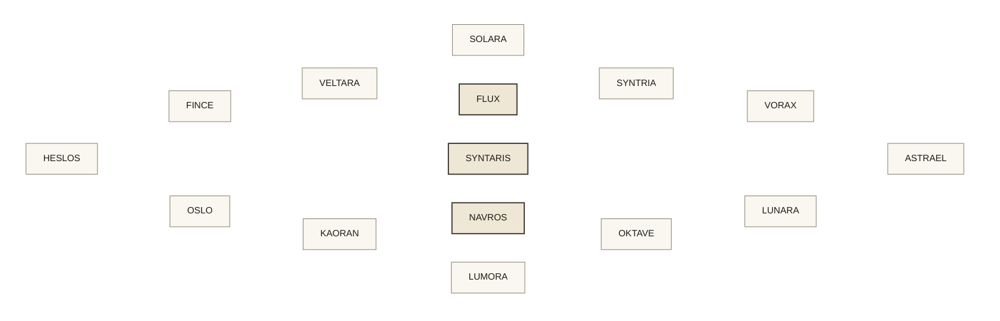
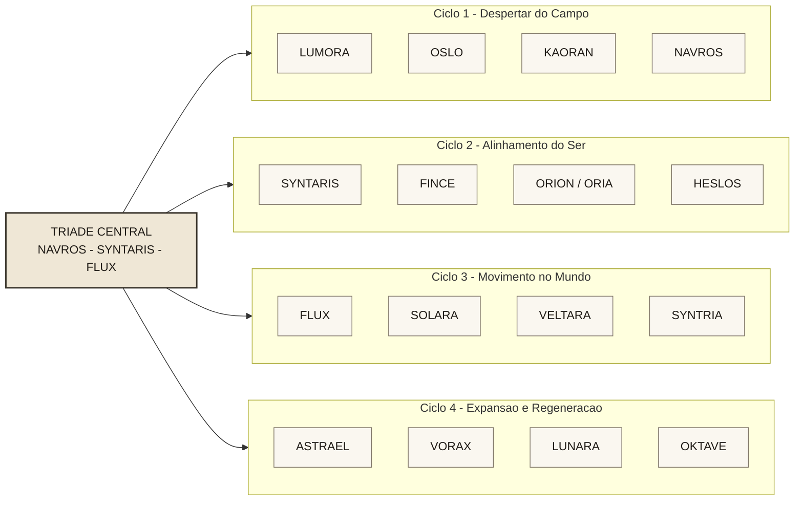
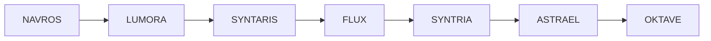

# Geometria da Mandala

## Status

Este documento registra a versao geometrica de trabalho da mandala em Mermaid. Ele foi construido para servir ao manual e a interface, mas continua ligado a uma camada exploratoria do sistema, nao a uma geometria canonica ja fechada.

Leituras de origem:

- camada canonica da mandala em [04_mandala_dos_agentes.md](../manual/04_mandala_dos_agentes.md)
- leitura exploratoria em [07_hipotese_dos_quatro_ciclos.md](../manual/07_hipotese_dos_quatro_ciclos.md)

## Uso Deste Documento

Esta doc serve para tres fins:

- visualizar a mandala como estrutura espacial
- alinhar design e produto antes da interface final
- manter uma referencia compartilhada para futuras iteracoes geometricas

Importante:

- o Mermaid abaixo e uma referencia estrutural
- ele nao substitui a futura geometria desenhada em Figma ou codigo
- o diagrama preserva legibilidade e relacoes, nao precisao matematica absoluta

## Diagrama Geometrico de Trabalho

## Leitura do Diagrama

No estado atual de trabalho, o diagrama sugere:

- triade central: `NAVROS`, `SYNTARIS`, `FLUX`
- anel externo: agentes e estados de travessia
- leitura por quadrantes: quatro ciclos de transformacao
- leitura por percurso: deslocamentos entre estados ao longo da jornada

## Diagrama por Ciclos

## Percurso de Exemplo

Esse percurso nao descreve um fluxo fixo do produto. Ele serve para mostrar como a mandala pode funcionar como mapa navegavel de estados.

## Regras de Leitura para Interface

Se a mandala for levada para interface, a geometria precisa preservar:

- centro legivel antes de qualquer detalhe periferico
- distincao visual clara entre nucleo e anel
- leitura por quadrantes sem exigir explicacao previa
- possibilidade de trilha recente do usuario
- expansao progressiva a partir da bussola inicial

## Limites do Modelo Atual

Mesmo com a visualizacao em Mermaid, algumas decisoes continuam abertas:

- o nucleo triadico e apenas motor ou tambem faz parte dos 16 estados
- `ORION` e `ORIA` seguem em conflito de nomenclatura
- `ANERA` e `ORIGEN` nao aparecem nessa geometria exploratoria
- `OKTAVE` oscila entre campo de origem e estado terminal
- a versao circular final exigira refinamento geometrico fora do Mermaid
