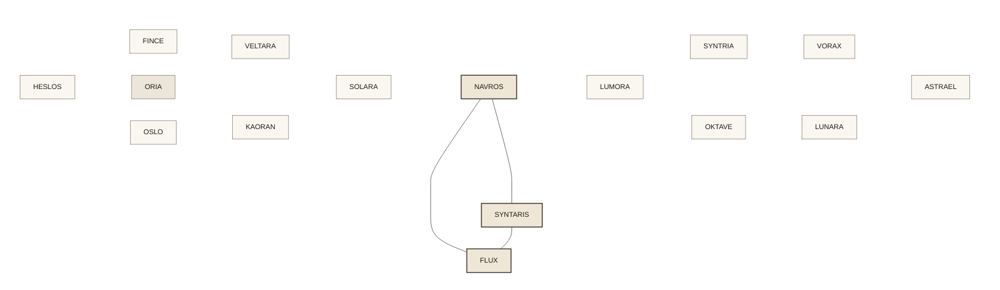
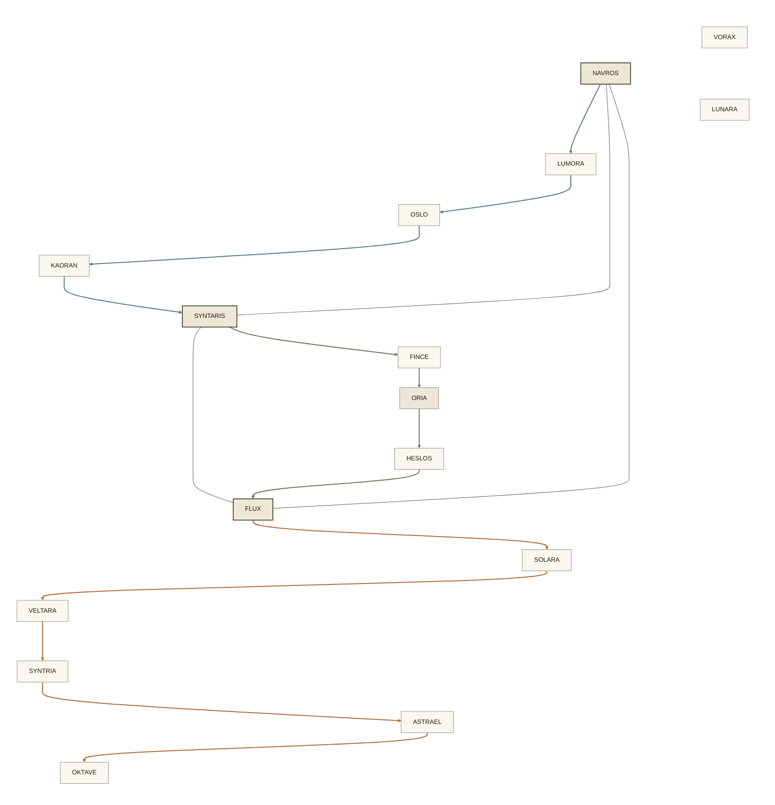
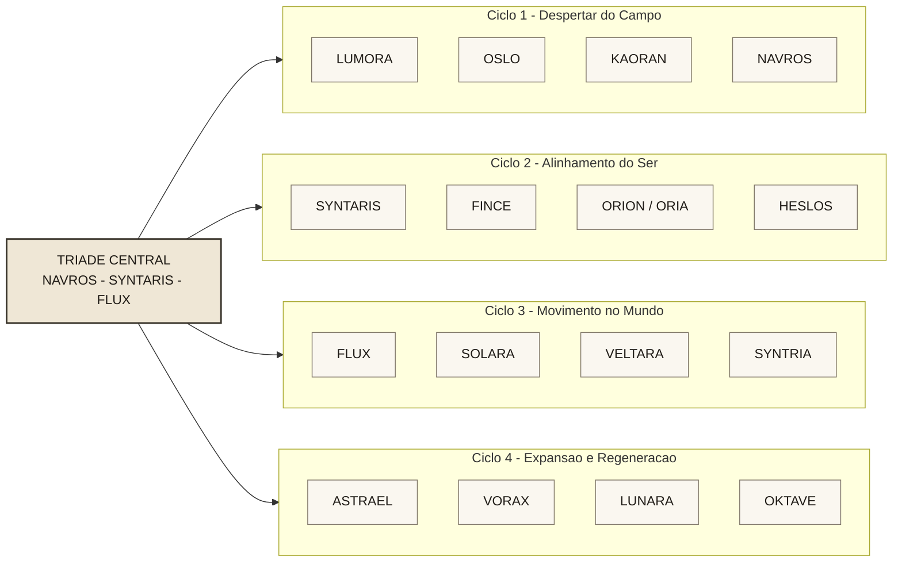
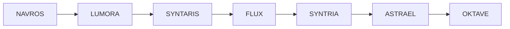

# Geometria da Mandala

## Status

Este documento registra a versao geometrica de trabalho da mandala em Mermaid. Ele foi construido para servir ao manual, ao frontend e a identidade simbolica do portal, mas continua ligado a uma camada exploratoria do sistema, nao a uma geometria canonica ja fechada.

Leituras de origem:

- camada canonica da mandala em [04_mandala_dos_agentes.md](../manual/04_mandala_dos_agentes.md)
- leitura exploratoria em [07_hipotese_dos_quatro_ciclos.md](../manual/07_hipotese_dos_quatro_ciclos.md)
- traducao para implementacao em [mandala-frontend-spec.md](mandala-frontend-spec.md)

## Uso Deste Documento

Esta doc serve para quatro fins:

- visualizar a mandala como simbolo estrutural do sistema
- alinhar design e produto antes da interface final
- registrar as tres rotas naturais como overlay de navegacao
- manter uma referencia compartilhada para futuras iteracoes geometricas

Importante:

- o Mermaid abaixo e uma referencia estrutural
- ele nao substitui a futura geometria desenhada em Figma ou codigo
- o diagrama preserva relacoes, niveis e vetores; nao promete precisao matematica absoluta

## Camadas Geometricas Fundamentais

A leitura mais forte surgida ate aqui descreve a mandala a partir de tres camadas simples:

1. circulo externo: o campo da experiencia
2. 16 ancoras equidistantes: estados de navegacao
3. triangulo central: motor de orientacao

Formula estrutural:

`circulo -> 16 ancoras -> triangulo central`

Essa formulacao ajuda a distinguir duas coisas que convivem no repositorio:

- a geometria simbolica da mandala, usada no manual e na identidade do sistema
- a projecao simplificada de interface, usada na V0 do frontend

## Dois Niveis de Geometria

Para evitar confusao, esta doc passa a separar explicitamente:

- geometria simbolica: circulo, anel de 16 ancoras e triangulo central equilatero
- projecao de interface: distribuicao simplificada e mais legivel para SVG e navegacao inicial

A primeira orienta o sentido profundo do sistema. A segunda orienta a implementacao pratica da V1.

## Modelo Radial Sector Grid

Uma leitura mais precisa para interface radial usa o modelo de `radial sector grid`. Nesse arranjo, a mandala combina:

1. centro
2. aneis concentricos
3. setores radiais

Formula de base:

`centro + aneis + setores`

No Portal Lichtara, isso produz uma leitura util:

- anel 0: `NAVROS`
- anel 1: rotas ou eixos de navegacao
- anel 2: 16 posicoes da mandala

Regra geometrica principal:

- `360 / 3 = 120deg` por setor de navegacao
- `360 / 16 = 22.5deg` por ancora do anel externo

Ponto importante:

- as `3` rotas organizam direcoes cognitivas
- os `4` ciclos continuam organizando quadrantes estruturais
- os `16` agentes continuam ocupando ancoras cartograficas

Ou seja, o grid radial nao apaga a estrutura anterior; ele a torna mais legivel.

## Diagrama Geometrico Simbolico

O desenho abaixo aproxima a mandala como simbolo estrutural: um campo externo com ancoras nomeadas e um triangulo central de navegacao.

Notas:

- `ORIA` continua em estado latente por conflito com `ORION`
- a ideia das 16 ancoras e mais ampla do que a lista de nomes hoje estabilizada no repo
- a mandala final pode manter ancoras geometricas mesmo quando alguns nomes ainda estiverem em revisao

## Leitura do Simbolo

O simbolo combina tres formas primarias:

- circulo: totalidade do campo de experiencia
- triangulo: estabilidade do motor de navegacao
- anel: estados de travessia do campo humano

Em linguagem direta:

`campo -> orientacao -> percurso`

## Diagrama das Tres Rotas Naturais

Quando as tres rotas sao sobrepostas ao nucleo triadico, a mandala deixa de ser apenas um diagrama estatico e passa a funcionar como mapa de navegacao.

Leitura do overlay:

- rota da Percepcao: `NAVROS -> LUMORA -> OSLO -> KAORAN -> SYNTARIS`
- rota da Estrutura: `SYNTARIS -> FINCE -> ORIA -> HESLOS -> FLUX`
- rota da Acao: `FLUX -> SOLARA -> VELTARA -> SYNTRIA -> ASTRAEL -> OKTAVE`

Quando vistas juntas, as tres rotas sugerem uma estrela triangular interna ao campo da mandala.

## Micro-ciclos de Travessia

As rotas naturais sugerem micro-ciclos com extensoes diferentes:

- Percepcao: 5 estados
- Estrutura: 5 estados
- Acao: 6 estados

Isso abre duas escalas para o portal:

- jornada curta: uma rota completa ativada por necessidade imediata
- jornada completa: encadeamento de varias rotas com retorno recorrente ao nucleo

Em produto, isso significa que o portal pode sustentar tanto uma leitura breve quanto uma travessia expandida sem trocar de mapa.

## Diagrama por Ciclos

## Percurso de Exemplo

Esse percurso nao descreve um fluxo fixo do produto. Ele serve para mostrar como a mandala pode funcionar como mapa navegavel de estados.

## Regras de Leitura para Interface

Se a mandala for levada para interface, a geometria precisa preservar:

- centro legivel antes de qualquer detalhe periferico
- triade reconhecivel mesmo quando o anel estiver expandido
- diferenca clara entre simbolo estrutural e projecao tecnica
- leitura por quadrantes sem exigir explicacao previa
- possibilidade de trilha recente do usuario
- ativacao das tres rotas a partir da pergunta `O que voce precisa agora?`

## Limites do Modelo Atual

Mesmo com a visualizacao atual, algumas decisoes continuam abertas:

- a contagem entre 16 ancoras geometricas e nomes efetivamente estabilizados segue incompleta
- o nucleo triadico e apenas motor ou tambem faz parte dos 16 estados
- `ORION` e `ORIA` seguem em conflito de nomenclatura
- `ANERA` e `ORIGEN` nao aparecem nessa geometria exploratoria
- `OKTAVE` oscila entre campo de origem e estado terminal
- a versao circular final exigira refinamento geometrico fora do Mermaid
- o componente-base atual do frontend ainda usa uma projecao simplificada, nao o simbolo final
